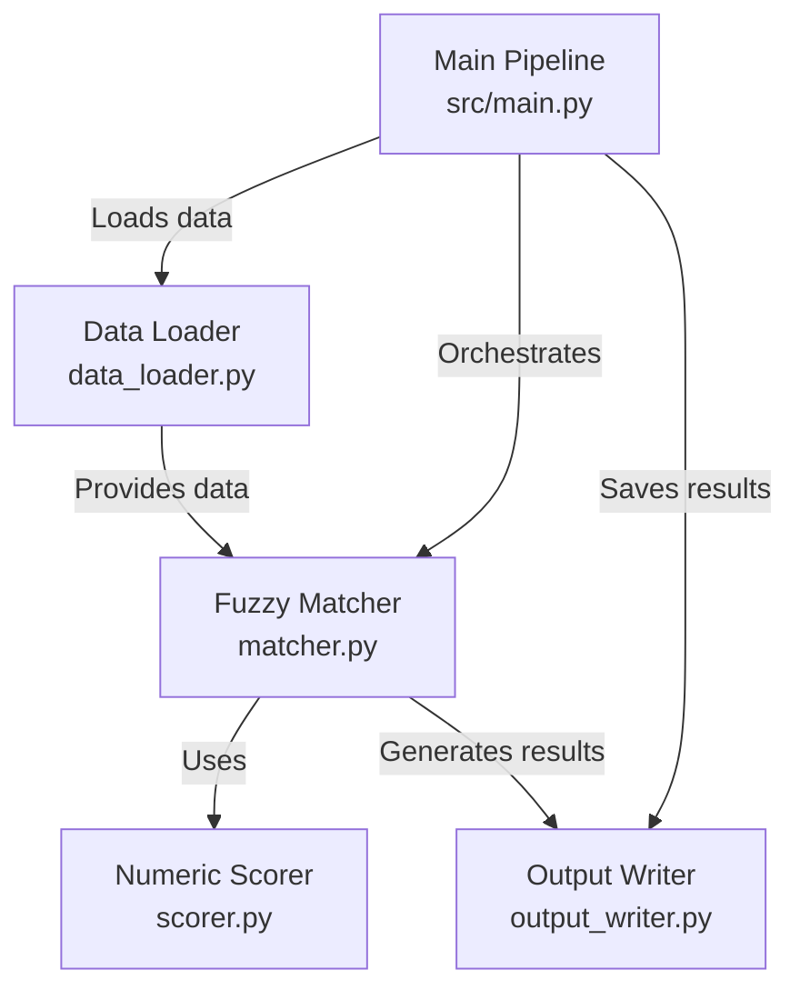

# Technical Documentation: Excel Fuzzy Matching Pipeline

## Architecture Overview

The pipeline follows a modular architecture with clear separation of concerns:



## Module Details

### 1. Configuration Module (`config/`)

**Purpose**: Centralize all configuration constants

**Files**:
- `constants.py` - All configurable parameters
- `__init__.py` - Module initialization

**Key Constants**:
```python
FUZZY_THRESHOLD = 70           # Minimum acceptance score
AMOUNT_TOLERANCE_PERCENT = 5   # Numeric matching tolerance
EXACT_MATCH_BONUS = 20         # Bonus for exact numeric match
```

### 2. Data Loader Module (`src/fuzzy_matcher/data_loader.py`)

**Purpose**: Load and clean Excel data

**Class**: `ExcelDataLoader`

**Methods**:
- `load_source_data()` - Load source file (Description + Amount)
- `load_reference_data()` - Load reference file (Description + Code)

**Data Cleaning Steps**:
1. Read Excel file with pandas
2. Validate required columns exist
3. Remove null/empty values
4. Convert amounts to numeric
5. Trim whitespace from strings
6. Reset DataFrame index

**Error Handling**:
- FileNotFoundError: File doesn't exist
- ValueError: Missing required columns
- General Exception: Pandas/openpyxl errors

### 3. Numeric-Aware Scorer Module (`src/fuzzy_matcher/scorer.py`)

**Purpose**: Calculate match scores with numeric consistency enforcement

**Class**: `NumericAwareScorer`

#### Key Algorithm: Numeric Consistency Check

```python
def check_numeric_consistency(source_amount, ref_description):
    # Extract all numbers from reference description
    ref_numbers = extract_numbers(ref_description)
    
    if no numbers found:
        return True, 0, "Neutral - no numbers to compare"
    
    tolerance = source_amount * tolerance_percent / 100
    
    for each ref_number:
        diff = abs(source_amount - ref_number)
        
        if diff == 0:
            return True, +20, "Exact match"
        
        if diff <= tolerance:
            score = 20 * (1 - diff/tolerance)
            return True, score, "Within tolerance"
    
    return False, -50, "Numeric mismatch"
```

#### Text Similarity Calculation

Uses RapidFuzz's `token_sort_ratio`:
- Tokenizes both strings
- Sorts tokens alphabetically
- Compares sorted token sequences
- Returns score 0-100

**Why token_sort_ratio?**
- Handles word order variations
- Resistant to minor differences
- Better than simple ratio for descriptions

#### Final Score Calculation

```
if numeric_consistent:
    final_score = min(100, text_score + numeric_bonus)
else:
    final_score = max(0, text_score + numeric_penalty)

Match Type:
  >= 90: High Confidence
  >= 70: Medium Confidence
  >= 50: Low Confidence
  <  50: Poor Match
```

### 4. Fuzzy Matcher Module (`src/fuzzy_matcher/matcher.py`)

**Purpose**: Orchestrate the matching process

**Class**: `FuzzyMatcher`

**Algorithm**:
```python
for each source_record:
    best_score = 0
    best_match = None
    
    for each reference_record:
        score = calculate_final_score(
            source_desc, 
            source_amount, 
            ref_desc
        )
        
        if score > best_score:
            best_score = score
            best_match = reference_record
    
    if best_score >= threshold:
        assign code
    else:
        assign "NO_MATCH"
    
    record audit details
```

**Complexity**: O(n × m) where n = source records, m = reference records

**Optimization Opportunities** (not implemented):
- Early stopping if perfect match found
- Caching of text similarity scores
- Parallel processing for large datasets
- Indexing reference data

### 5. Output Writer Module (`src/fuzzy_matcher/output_writer.py`)

**Purpose**: Generate Excel outputs with formatting

**Class**: `ExcelOutputWriter`

**Methods**:
- `save_results()` - Write matched results to Excel
- `save_audit_log()` - Write detailed audit log with auto-width columns
- `generate_summary_report()` - Create text summary

**Excel Formatting**:
- Auto-adjust column widths
- Cap maximum width at 50 characters
- Professional sheet naming
- Clean DataFrame index (no row numbers)

### 6. Main Pipeline (`src/main.py`)

**Purpose**: Orchestrate the entire pipeline

**Execution Flow**:
1. Setup logging (console + file)
2. Load source data
3. Load reference data
4. Perform fuzzy matching
5. Save matched results
6. Generate audit log
7. Display summary report

**Error Handling**:
- FileNotFoundError: Specific message about missing files
- General Exception: Full traceback for debugging
- Exit codes: 0 = success, 1 = failure

## Algorithm Deep Dive

### Why Numeric-Aware Matching?

Traditional fuzzy matching only compares text:
```
"Office supplies 150" → "Office supplies 200"
Text similarity: 95% ✓ MATCHED
But amounts don't match! 150 ≠ 200 ✗
```

With numeric awareness:
```
"Office supplies 150" → "Office supplies 200"
Text similarity: 95%
Numeric check: FAIL (-50 penalty)
Final score: 45% ✗ NO MATCH
```

### Scoring Rationale

**Text Score (0-100)**:
- Base similarity between descriptions
- Uses proven algorithm (RapidFuzz)

**Numeric Bonus (+0 to +20)**:
- Rewards numeric consistency
- Exact match gets full +20
- Within tolerance gets partial bonus
- No penalty if no numbers in reference

**Numeric Penalty (-50)**:
- Heavily penalizes mismatched numbers
- Ensures failed numeric consistency → rejected match
- Prevents false positives

**Final Score Range**:
- Maximum: 120 (capped at 100)
- Minimum: 0 (floored at 0)
- Threshold typically 70

### Match Type Classification

| Score Range | Classification | Recommendation |
|-------------|----------------|----------------|
| 90-100 | High Confidence | Auto-accept |
| 70-89 | Medium Confidence | Accept with spot check |
| 50-69 | Low Confidence | Manual review required |
| 0-49 | Poor Match | Likely incorrect |

## Performance Characteristics

### Time Complexity
- **Data Loading**: O(n + m)
- **Matching**: O(n × m × k) where k = avg text length
- **Output Writing**: O(n)
- **Overall**: O(n × m) for typical cases

### Space Complexity
- **DataFrames**: O(n + m)
- **Results**: O(n)
- **Audit Log**: O(n)
- **Overall**: O(n + m)

### Benchmarks (Approximate)

| Source Records | Reference Records | Time |
|----------------|-------------------|------|
| 10 | 10 | < 1s |
| 100 | 100 | ~5s |
| 1,000 | 1,000 | ~8 min |
| 10,000 | 1,000 | ~80 min |

*Note: Times vary based on hardware and text length*

## Design Decisions

### 1. Why pandas + openpyxl?
- **pandas**: Industry standard for data manipulation
- **openpyxl**: Native Excel support without Excel installation
- **Alternative considered**: xlrd/xlwt (deprecated)

### 2. Why RapidFuzz over FuzzyWuzzy?
- **RapidFuzz**: C++ implementation, 10x faster
- **RapidFuzz**: Active maintenance
- **RapidFuzz**: Better API design
- **FuzzyWuzzy**: Legacy, slower

### 3. Why token_sort_ratio?
- Handles word order: "supplies office" ≈ "office supplies"
- Better than partial_ratio for full descriptions
- More consistent than simple ratio

### 4. Why -50 penalty for numeric mismatch?
- Ensures rejection even with high text similarity
- Example: 95% text - 50 penalty = 45% → below 70% threshold
- Tunable via configuration if needed

### 5. Why O(n × m) instead of optimized search?
- Simple and maintainable
- Deterministic and explainable
- Fast enough for typical use cases (<10k records)
- Can be optimized later if needed

## Extensibility

### Adding Custom Scoring Logic

```python
class CustomScorer(NumericAwareScorer):
    def calculate_final_score(self, source_desc, source_amount, ref_desc):
        # Add custom logic here
        score, details = super().calculate_final_score(
            source_desc, source_amount, ref_desc
        )
        
        # Example: Boost score for exact description match
        if source_desc.lower() == ref_desc.lower():
            score += 10
            details['explanation'] += " + Exact description match"
        
        return score, details
```

### Adding New Data Sources

```python
class CSVDataLoader(ExcelDataLoader):
    @staticmethod
    def load_source_data(filepath, desc_col, amount_col):
        df = pd.read_csv(filepath)
        # Rest of the logic same as Excel loader
```

### Adding ML-Based Matching

```python
class MLMatcher(FuzzyMatcher):
    def __init__(self, model_path, threshold=70):
        super().__init__(threshold)
        self.model = load_model(model_path)
    
    def find_best_match(self, source_desc, source_amount, reference_df):
        # Use ML model for matching
        embeddings = self.model.encode([source_desc])
        # ... ML matching logic
```

## Security Considerations

1. **Input Validation**:
   - All inputs validated before processing
   - Numeric conversions with error handling
   - Empty/null value handling

2. **File Path Safety**:
   - Use pathlib for cross-platform compatibility
   - Validate file existence before operations

3. **Data Privacy**:
   - No external API calls
   - All processing local
   - No data transmission

4. **Error Exposure**:
   - Detailed errors in logs
   - User-friendly errors on console
   - No sensitive data in error messages

## Testing Strategy

### Unit Tests (`tests/test_scorer.py`)
- Test numeric extraction
- Test numeric consistency checks
- Test text similarity
- Test final score calculation
- Test edge cases

### Integration Test
- End-to-end pipeline execution
- Sample data processing
- Output verification

### Future Testing
- Performance benchmarks
- Stress testing with large datasets
- Edge case scenarios
- Error handling validation

## Future Enhancements

1. **Performance**:
   - Parallel processing with multiprocessing
   - Caching of similarity scores
   - Approximate nearest neighbor search

2. **Features**:
   - Support for multiple amount columns
   - Fuzzy numeric matching (ranges)
   - Machine learning option
   - Web interface

3. **Quality**:
   - More comprehensive tests
   - Type hints throughout
   - API documentation
   - Performance profiling

4. **Usability**:
   - CLI with arguments
   - Configuration file support (YAML/JSON)
   - Progress bar for large datasets
   - Interactive mode

## Maintenance

### Dependency Updates
- Check for updates quarterly
- Test thoroughly before upgrading
- Pin versions in requirements.txt

### Monitoring
- Track matching quality over time
- Monitor performance metrics
- Review audit logs for patterns

### Code Quality
- Follow PEP 8 style guide
- Use type hints
- Document complex logic
- Keep functions small and focused

## Conclusion

This pipeline provides a production-ready, explainable, and maintainable solution for Excel fuzzy matching with numeric awareness. The modular design allows for easy customization and extension while maintaining code quality and reliability.
